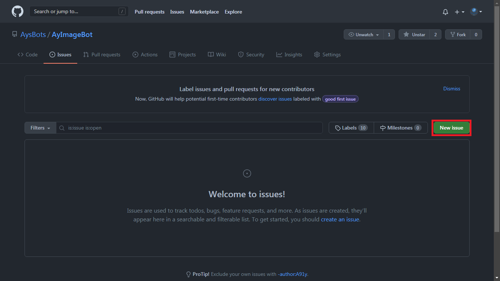
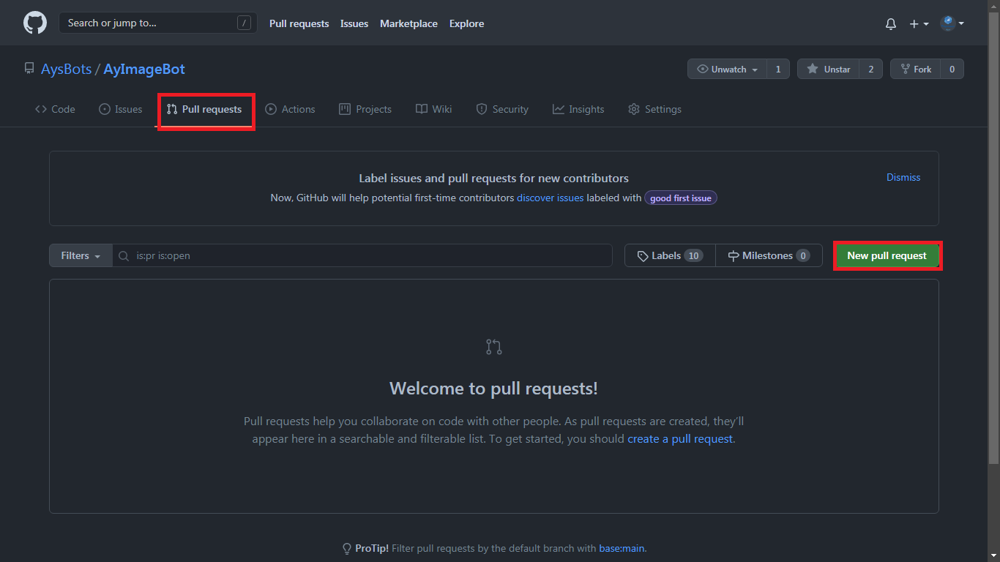

# Contributing Guidelines

First off, thanks for taking the time to contribute! 
😄


Contributions are handled in the form of Pull Requests. You fork this repository, create a new branch, make relevant changes, and submit a Pull Request – once that's done we'll be able to review your PRs and merge them to the main branch.

Always submit a PR against a "Claimed Issue" that's been assigned to you. If an issue doesn't exist, please raise one first and wait for it to be labelled, and then have it assigned to you. PRs without having accepted issues mentioned will be closed.

## Process Flow

- Go to issue tab


- Raise a new issue or check if already exists.



- Finally submit the pull request.



## Formatting

Format your PR titles likewise:

> [Tag]: Describe change in present tense

Tag can be:

- Feat (new feature)
- Fix (bug fix)
- Refactor (refactoring code)
- Style (formatting, no code change)
- Doc (changes to documentation)
- Test (adding or refactoring tests; no production code change)

Remember to:

- Capitalize the subject line
- Use the imperative mood in the subject line

## Development Requirements
- Get Free image api from [Unsplash Developers](https://unsplash.com/developers)
- Get Free telegram bot api from [Telegram Botfather](https://t.me/BotFather)
- Create ```.env``` file
```
AYIMAGEBOT_API_KEY = '<telegram-bot-api-here>'
UNSPLASH_CLIENT_KEY = '<unsplash-api-here>'

```


## *Important* for contributors:
- If you are adding a *new feature*, then create a new file / modify files in `contrib` directory only.
- You can *modify* `core` directory only, if you are fixing a *bug*.

### Happy Coding !!
